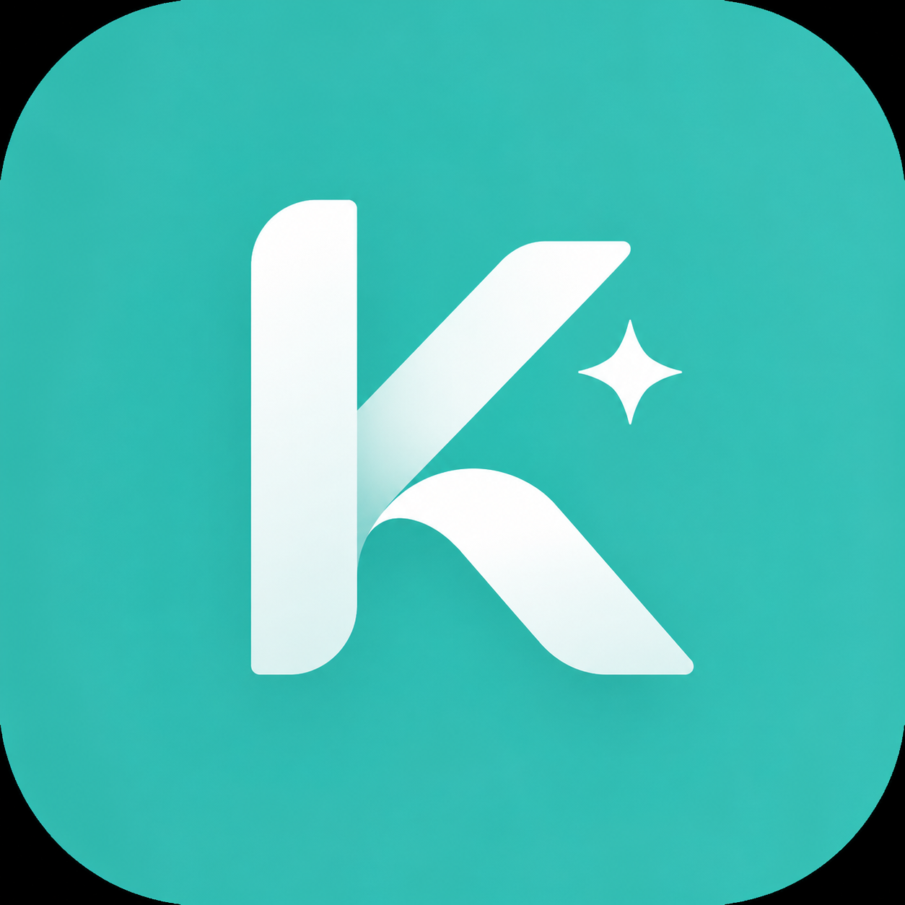

   

      
      <h1 style="font-size: 32px; font-weight: bold;">Karkun AI</h1>
   

   
<strong>Google AI Seekho | Antigravity Hackathon 2026</strong>

   
<em>Solution for Challenge 2: AI Service Orchestrator for Informal Economy</em>

---

## 📖 Overview

**Karkun AI** is our solution to the "AI Service Orchestrator for Informal Economy" challenge. The informal service sector (plumbers, electricians, beauticians, etc.) heavily relies on unstructured WhatsApp messages and calls, leading to missed opportunities and poor user experience. 

Our Agentic AI System automates the end-to-end lifecycle of a service request. It understands user intents in natural languages (English, Urdu, Roman Urdu), finds the best service providers using localized context, simulates a booking, and follows up seamlessly. 

Our core philosophy for this hackathon: **Focus on the core goal, maintain a frictionless UX, and implement robust AI guardrails without over-engineering.**

---

## 🏛️ Architecture & Design

We built a mobile-first application using Next.js packaged with Capacitor. The backend intelligence is entirely powered by the **Gemini API**, utilizing an orchestrator pattern to manage a multi-step reasoning pipeline.

Instead of adding bloat like authentication flows, we focused deeply on the prompt orchestration and agent handoffs. 

### Data & APIs Used:
- **Core AI Backbone:** Gemini API (`gemini-3-flash-preview`)
- **Service Data:** Mocked providers dataset (simulating a rich database of local workers with ratings, distances, and categories).
- **Location Data:** Mocked maps and user location data for quick proximity matching.
- **Booking Engine:** Simulated booking confirmation and assignment execution.

---

## 🤖 The 4 AI Agents

Our orchestrator seamlessly chains four distinct custom-instruction-based AI agents, passing context and reasoning logs between them:

1. **Intent Extraction & Context Agent**  
   Processes natural language to extract the service type, urgency, location, and language. It also analyzes the context to see if the user is making a new request or following up on a previous one.
2. **Provider Discovery & Ranking Agent**  
   Takes the parsed intent and queries the mock database. It runs a ranking logic that weighs direct matches, proximity (distance), and quality (ratings) to confidently select the absolute best match or recommend top alternatives.
3. **Communication & Synthesis Agent**  
   Generates a warm, natural response. **Crucially, it speaks back in the exact same language the user initiated the prompt with** (e.g., replying in Roman Urdu if asked in Roman Urdu). It provides a simple, layperson-friendly explanation of *why* the provider was chosen.
4. **Booking & Follow-up Agent**  
   Simulates the dispatching and confirmation of the provider. It provides a receipt and schedules follow-up reminders.

---

## ✨ Core Features & Highlights

### ⚡ Auto-Booking with Cautionary UX
We achieved the core goal of automated action through an **Auto-Booking** feature. However, to ensure user safety and awareness, we implemented a **60-second cautionary countdown**. If the user does nothing, the agent automatically secures the booking for them. The user is fully aware and retains the power to cancel before the timer runs out.

### 🛡️ AI Guardrails (Extra Features)
We went beyond the basic requirements to ensure our AI is safe and reliable for public use:
1. **Profanity & Inappropriate Content Guardrails:** The Intent Agent strictly screens inputs for bad or adult language, cleanly rejecting inappropriate requests with a polite refusal.
2. **Prompt Injection Protection:** The system is fortified against jailbreaks. If a user attempts to bypass instructions or inject malicious prompts, the agent flags it and safely neutralizes the interaction.

---

## 🎨 UX & UI Approach

We designed Karkun AI to be simple, beautiful, and highly intuitive. 

- **Aesthetics:** We utilized a modern **Material You** inspired "Teal" coloring system. 
- **Simplicity:** The UI feels like a familiar chat interface but enhanced with rich UI cards for provider profiles, interactive timers, and clear reasoning logs.
- **Transparency:** The app displays a collapsible "Agent Logs" section so the user (and judges!) can see the real-time reasoning, tool usage, and handoffs happening behind the scenes. 
- **No Over-engineering:** The interface focuses solely on getting the user from intent to booking as fast and beautifully as possible.

---

## 🛠️ Tech Stack
- **Frontend Framework:** Next.js (React)
- **Mobile Wrapper:** Capacitor
- **Styling:** Tailwind CSS + Framer Motion (for smooth micro-animations)
- **AI / LLM:** Google GenAI SDK (Gemini API)

---

**JazakAllah Khair** 🚀
